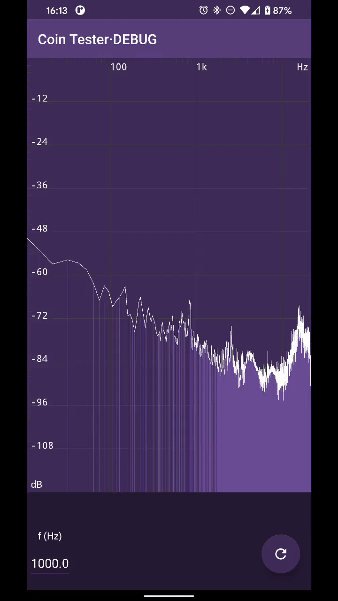

# Coin Tester
Application for detecting coins depending on their resonance frequency.

Install it on [Google Play](https://play.google.com/store/apps/details?id=com.appacoustic.cointester).

## Thanks
This project is based on [audio-analyzer-for-android](https://github.com/bewantbe/audio-analyzer-for-android).

Special thanks to [Eddy Xiao](https://github.com/bewantbe).

## Disclaimer
I have started the project from a first approach I made time ago and I am not sure all the sources code the project is based are well-cited. I am working on it.

Anyway, if you see any class or whatever that needs any reference to any code, please tell me (or do a PR). I will be very grateful to include it.

More info on [AppAcoustiC](http://appacoustic.com/).
